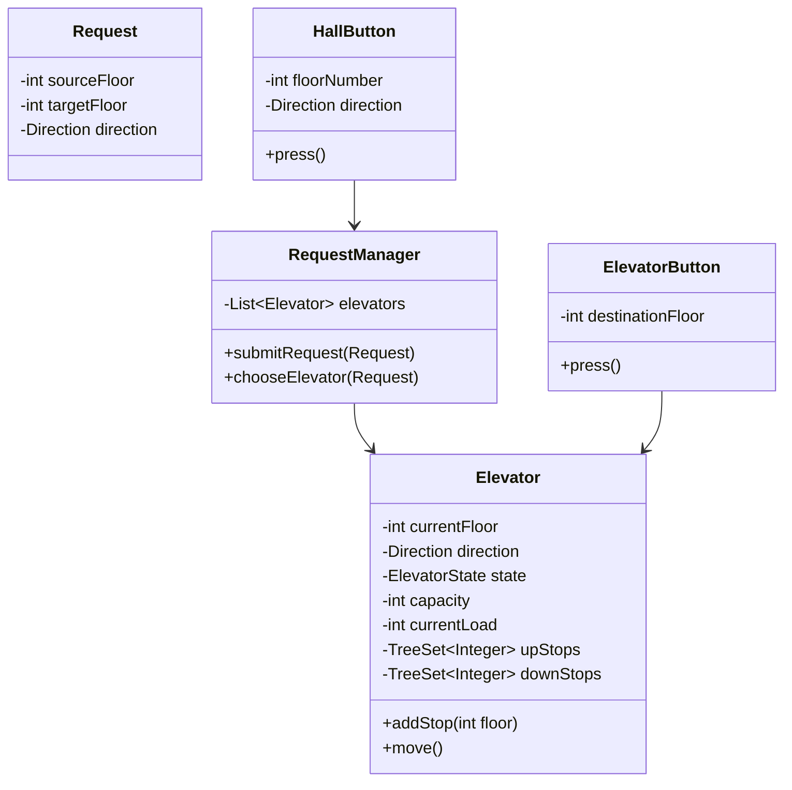

---

# 1. Problem Decomposition

The goal is to design an **elevator control system** that manages multiple elevators in a building and efficiently handles user requests.

The system must:

* Accept **requests from floors (UP/DOWN buttons)**
* Accept **destination selections inside elevators**
* Assign the **best elevator** to handle a request
* Move elevators while respecting **direction and pending stops**

The **core mission** of the system is:

> Efficiently schedule elevators to serve requests while maintaining correct elevator state and minimizing unnecessary movement.

---

# 2. Clarifying Questions

Before designing, I would ask the interviewer:

1. **How many elevators are in the building?**
2. **How many floors does the building have?**
3. Should we optimize for **fastest response time or simplest logic**?
4. Do elevators have a **maximum capacity**?
5. Should elevators follow **real-world scheduling rules** (direction-based)?
6. Do we need to support **multiple requests simultaneously**?
7. Is the scope only **elevator control logic** or also **UI/display panels**?

Typical assumption for LLD:

> Focus on **core elevator scheduling logic**, not UI or networking.

---

# 3. The Mental Model

For a system like elevators, we start with **Entities (Nouns)**.

Important nouns from the problem:

```
Elevator
Request
Button
RequestManager
```

From our discussion we also identified:

```
HallButton
ElevatorButton
```

Actions (verbs) naturally follow:

```
submitRequest()
assignElevator()
move()
addStop()
```

A **common mistake** candidates make:

❌ Letting elevators assign themselves.

Better design:

✔ A **central coordinator** decides which elevator handles requests.

---

# 4. The First Move (Foundation Class)

The first system component to design is:

```
RequestManager
```

Why?

Because it acts as the **dispatcher** for the system.

Responsibilities:

```
Receive requests
Select best elevator
Assign request to elevator
```

System flow:

```
Button Press
     ↓
   Request
     ↓
RequestManager
     ↓
 Elevator
```

Without this coordinator, elevator scheduling becomes messy.

---

# 5. Data Structure Decisions

## Elevator Stops

Elevators must store **pending stops**.

Naively we might use:

```
List<Integer>
```

But this causes inefficient movement.

Better choice:

```
TreeSet<Integer>
```

Why?

* Keeps floors **sorted automatically**
* Efficient lookup for next stop
* Supports direction-aware scheduling

Example:

```
upStops   → floors above current
downStops → floors below current
```

---

## Elevator Storage

The dispatcher must track all elevators.

```
List<Elevator>
```

Why?

* Buildings have small fixed elevator counts
* Iteration is sufficient for scheduling

---

## Capacity Tracking

Elevators should maintain:

```
currentLoad
maxCapacity
```

This prevents assigning requests to full elevators.

---

# 6. Design Patterns

## Strategy Pattern (Scheduling)

Elevator selection can vary.

Examples:

```
NearestElevatorStrategy
DirectionalStrategy
LoadBalancingStrategy
```

The `RequestManager` can use a strategy interface.

---

## Single Responsibility Principle

We separate responsibilities:

```
HallButton       → create pickup requests
ElevatorButton   → create destination requests
RequestManager   → assign elevators
Elevator         → manage movement
```

Avoids large monolithic classes.

---

# 7. Class Diagram



---

# 8. Java Implementation

## Direction Enum

```java
enum Direction {
    UP,
    DOWN,
    IDLE
}
```

---

## Elevator State

```java
enum ElevatorState {
    MOVING,
    IDLE,
    DOOR_OPEN
}
```

---

# Request

```java
public class Request {

    private final int sourceFloor;
    private final int targetFloor;
    private final Direction direction;

    public Request(int sourceFloor, int targetFloor, Direction direction) {
        this.sourceFloor = sourceFloor;
        this.targetFloor = targetFloor;
        this.direction = direction;
    }

    public int getSourceFloor() { return sourceFloor; }
    public int getTargetFloor() { return targetFloor; }
    public Direction getDirection() { return direction; }
}
```

---

# Elevator

```java
import java.util.TreeSet;

public class Elevator {

    private int currentFloor;
    private Direction direction;
    private ElevatorState state;

    private int capacity;
    private int currentLoad;

    private TreeSet<Integer> upStops = new TreeSet<>();
    private TreeSet<Integer> downStops = new TreeSet<>();

    public Elevator(int capacity) {
        this.capacity = capacity;
        this.direction = Direction.IDLE;
        this.state = ElevatorState.IDLE;
        this.currentFloor = 0;
    }

    public void addStop(int floor) {

        if(floor > currentFloor)
            upStops.add(floor);
        else
            downStops.add(floor);
    }

    public void move() {

        if(direction == Direction.UP && !upStops.isEmpty()) {
            currentFloor = upStops.pollFirst();
        }
        else if(direction == Direction.DOWN && !downStops.isEmpty()) {
            currentFloor = downStops.pollLast();
        }
    }

    public int getCurrentFloor() {
        return currentFloor;
    }

    public Direction getDirection() {
        return direction;
    }

    public boolean isIdle() {
        return state == ElevatorState.IDLE;
    }
}
```

---

# RequestManager

```java
import java.util.List;

public class RequestManager {

    private List<Elevator> elevators;

    public RequestManager(List<Elevator> elevators) {
        this.elevators = elevators;
    }

    public void submitRequest(Request request) {

        Elevator best = chooseElevator(request);

        if(best != null)
            best.addStop(request.getSourceFloor());
    }

    private Elevator chooseElevator(Request request) {

        Elevator best = null;
        int minDistance = Integer.MAX_VALUE;

        for(Elevator e : elevators) {

            if(e.getDirection() == request.getDirection() || e.isIdle()) {

                int distance =
                        Math.abs(e.getCurrentFloor() - request.getSourceFloor());

                if(distance < minDistance) {
                    minDistance = distance;
                    best = e;
                }
            }
        }

        return best;
    }
}
```

---

# HallButton

```java
public class HallButton {

    private int floorNumber;
    private Direction direction;
    private RequestManager manager;

    public HallButton(int floorNumber, Direction direction, RequestManager manager) {
        this.floorNumber = floorNumber;
        this.direction = direction;
        this.manager = manager;
    }

    public void press() {
        manager.submitRequest(
            new Request(floorNumber, floorNumber, direction)
        );
    }
}
```

---

# ElevatorButton

```java
public class ElevatorButton {

    private int destinationFloor;
    private Elevator elevator;

    public ElevatorButton(int destinationFloor, Elevator elevator) {
        this.destinationFloor = destinationFloor;
        this.elevator = elevator;
    }

    public void press() {
        elevator.addStop(destinationFloor);
    }
}
```

---

# Common LLD Interview Traps

### Trap 1 — Elevator decides everything

Bad design:

```
Elevator.assignRequest()
```

Better:

```
RequestManager assigns elevator
```

Centralized scheduling.

---

### Trap 2 — Using List for stops

Bad:

```
List<Integer> stops
```

May cause inefficient movement.

Better:

```
TreeSet or directional queues
```

---

### Trap 3 — One giant Button class

Bad:

```
Button(type = HALL | ELEVATOR)
```

Better:

```
HallButton
ElevatorButton
```

Cleaner responsibilities.

---

# If This Were a Real Interview

A senior engineer would likely ask follow-up questions like:

1. How would you handle **peak traffic optimization**?
2. How would you support **priority elevators (VIP/firefighters)**?
3. How would you handle **elevator breakdowns**?
4. How would you simulate **real-time movement and scheduling**?

These extend the design.

---
