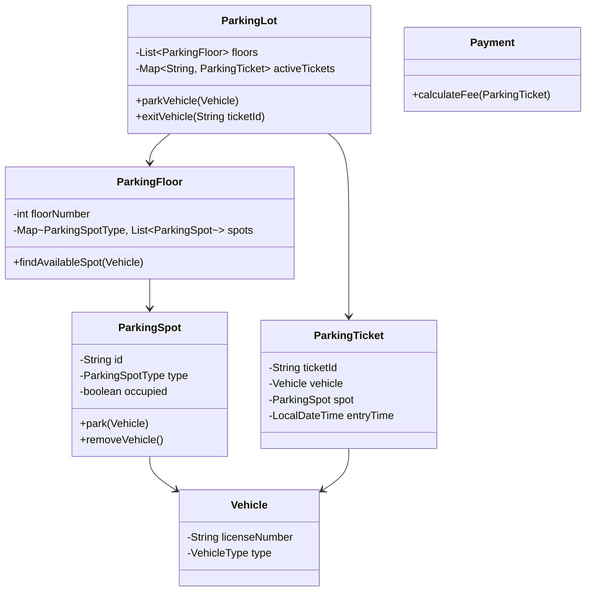

## Problem Decomposition

The system manages a **parking lot where vehicles enter, park in an appropriate spot, and exit while paying a fee**. The system must track parking spot availability, assign spots to vehicles based on compatibility (bike, car, truck), and calculate parking fees when the vehicle leaves.

The primary mission of this code is to **efficiently manage parking spot allocation and vehicle lifecycle (entry → parking → exit → payment)** while maintaining accurate state of the parking lot.

---

## Clarifying Questions (Ask the Interviewer)

These questions define scope and prevent over-engineering.

1. What **types of vehicles** should we support? (Bike, Car, Truck?)
2. Do **different vehicle types require different parking spot types**?
3. Should we support **multiple floors** or just a single floor?
4. How should the **parking fee be calculated**? (Flat fee, hourly, vehicle-based?)
5. Do we need **concurrent entry/exit handling**?
6. Should the system support **reservations**?
7. Do we need **real-time display boards** showing available spots?

For an SDE-1 interview, a common assumption:

* Multiple floors
* Spot types (Bike, Compact, Large)
* Vehicle types mapped to spot types
* Hourly billing

---

## The Mental Model

Start with **Entities (Nouns)** first.

In LLD interviews, nouns almost always reveal the classes.

Core nouns here:

* ParkingLot
* ParkingFloor
* ParkingSpot
* Vehicle
* Ticket
* Payment

Once the entities exist, the **actions (verbs)** become clear:

* parkVehicle()
* unparkVehicle()
* generateTicket()
* calculateFee()

So the thinking flow should be:

```
Entities → Relationships → Responsibilities → APIs
```

---

## The "First Move"

The first class to write should be **ParkingLot**.

Why?

* It acts as the **system entry point**
* Coordinates floors, parking spots, and tickets
* Represents the **top-level aggregate**

Everything flows through it:

```
Vehicle arrives → ParkingLot → allocate spot → issue ticket
Vehicle exits → ParkingLot → calculate fee → free spot
```

Many candidates incorrectly start with **ParkingSpot** or **Vehicle**, which leads to fragmented design.

---

## Data Structure Decisions

### 1️⃣ Parking Floors

```
List<ParkingFloor>
```

Why:

* Parking lots naturally have ordered floors
* Sequential iteration is sufficient

---

### 2️⃣ Parking Spots per Floor

```
Map<ParkingSpotType, List<ParkingSpot>>
```

Why:

* Efficient grouping by spot type
* Faster search for compatible spots

---

### 3️⃣ Active Tickets

```
Map<String, ParkingTicket>
```

Key = ticketId

Why:

* O(1) lookup when vehicle exits

---

### 4️⃣ Spot Availability

Inside each spot:

```
boolean isOccupied
```

Simple and efficient.

---

## Design Patterns

### Strategy Pattern (Fee Calculation)

Parking fee policies may change:

* hourly
* flat rate
* weekend pricing

Instead of hardcoding logic:

```
ParkingFeeStrategy
```

Different implementations:

```
HourlyFeeStrategy
FlatRateStrategy
```

---

### Factory Pattern (Vehicle Creation)

To encapsulate vehicle creation logic:

```
VehicleFactory.createVehicle(type)
```

Helps when vehicle types expand.

---

## Class Diagram



---

# Implementation (Java)

### Enums

```java
enum VehicleType {
    BIKE,
    CAR,
    TRUCK
}

enum ParkingSpotType {
    SMALL,
    MEDIUM,
    LARGE
}
```

---

### Vehicle

```java
class Vehicle {

    private final String licenseNumber;
    private final VehicleType type;

    public Vehicle(String licenseNumber, VehicleType type) {
        this.licenseNumber = licenseNumber;
        this.type = type;
    }

    public VehicleType getType() {
        return type;
    }

    public String getLicenseNumber() {
        return licenseNumber;
    }
}
```

---

### ParkingSpot

```java
class ParkingSpot {

    private final String id;
    private final ParkingSpotType type;
    private boolean occupied;
    private Vehicle vehicle;

    public ParkingSpot(String id, ParkingSpotType type) {
        this.id = id;
        this.type = type;
        this.occupied = false;
    }

    public boolean isAvailable() {
        return !occupied;
    }

    public boolean canFitVehicle(Vehicle vehicle) {
        if (vehicle.getType() == VehicleType.BIKE)
            return true;

        if (vehicle.getType() == VehicleType.CAR)
            return type == ParkingSpotType.MEDIUM || type == ParkingSpotType.LARGE;

        return type == ParkingSpotType.LARGE;
    }

    public void parkVehicle(Vehicle vehicle) {
        if (occupied) {
            throw new IllegalStateException("Spot already occupied");
        }
        this.vehicle = vehicle;
        this.occupied = true;
    }

    public void removeVehicle() {
        this.vehicle = null;
        this.occupied = false;
    }

    public String getId() {
        return id;
    }
}
```

---

### ParkingFloor

```java
import java.util.*;

class ParkingFloor {

    private final int floorNumber;
    private final List<ParkingSpot> spots;

    public ParkingFloor(int floorNumber, List<ParkingSpot> spots) {
        this.floorNumber = floorNumber;
        this.spots = spots;
    }

    public Optional<ParkingSpot> findAvailableSpot(Vehicle vehicle) {
        return spots.stream()
                .filter(spot -> spot.isAvailable() && spot.canFitVehicle(vehicle))
                .findFirst();
    }
}
```

---

### ParkingTicket

```java
import java.time.LocalDateTime;
import java.util.UUID;

class ParkingTicket {

    private final String ticketId;
    private final Vehicle vehicle;
    private final ParkingSpot spot;
    private final LocalDateTime entryTime;

    public ParkingTicket(Vehicle vehicle, ParkingSpot spot) {
        this.ticketId = UUID.randomUUID().toString();
        this.vehicle = vehicle;
        this.spot = spot;
        this.entryTime = LocalDateTime.now();
    }

    public String getTicketId() {
        return ticketId;
    }

    public ParkingSpot getSpot() {
        return spot;
    }

    public LocalDateTime getEntryTime() {
        return entryTime;
    }
}
```

---

### Fee Strategy

```java
interface ParkingFeeStrategy {
    double calculateFee(ParkingTicket ticket);
}
```

---

### Hourly Fee

```java
import java.time.Duration;
import java.time.LocalDateTime;

class HourlyFeeStrategy implements ParkingFeeStrategy {

    private static final double RATE_PER_HOUR = 10.0;

    @Override
    public double calculateFee(ParkingTicket ticket) {
        long hours = Duration.between(ticket.getEntryTime(), LocalDateTime.now()).toHours() + 1;
        return hours * RATE_PER_HOUR;
    }
}
```

---

### ParkingLot (Main Controller)

```java
import java.util.*;

class ParkingLot {

    private final List<ParkingFloor> floors;
    private final Map<String, ParkingTicket> activeTickets;
    private final ParkingFeeStrategy feeStrategy;

    public ParkingLot(List<ParkingFloor> floors, ParkingFeeStrategy feeStrategy) {
        this.floors = floors;
        this.feeStrategy = feeStrategy;
        this.activeTickets = new HashMap<>();
    }

    public String parkVehicle(Vehicle vehicle) {

        for (ParkingFloor floor : floors) {
            Optional<ParkingSpot> spot = floor.findAvailableSpot(vehicle);

            if (spot.isPresent()) {
                ParkingSpot parkingSpot = spot.get();
                parkingSpot.parkVehicle(vehicle);

                ParkingTicket ticket = new ParkingTicket(vehicle, parkingSpot);
                activeTickets.put(ticket.getTicketId(), ticket);

                return ticket.getTicketId();
            }
        }

        throw new RuntimeException("Parking Full");
    }

    public double exitVehicle(String ticketId) {

        ParkingTicket ticket = activeTickets.get(ticketId);

        if (ticket == null) {
            throw new IllegalArgumentException("Invalid ticket");
        }

        ticket.getSpot().removeVehicle();

        double fee = feeStrategy.calculateFee(ticket);

        activeTickets.remove(ticketId);

        return fee;
    }
}
```

---

## Interview Traps (Very Common)

### Trap 1: One Huge ParkingLot Class

Many candidates put everything inside one class.

Bad design:

```
ParkingLot
   parkVehicle
   createTicket
   calculateFee
   manageSpots
```

Better:

```
ParkingLot -> orchestration
ParkingFloor -> spot search
ParkingSpot -> vehicle placement
FeeStrategy -> billing logic
```

---

### Trap 2: Hardcoding Vehicle Logic

Bad:

```
if(vehicle == CAR) ...
```

Better:

```
spot.canFitVehicle(vehicle)
```

Encapsulation matters.

---

### Trap 3: Ignoring Extensibility

Future features might include:

* EV charging spots
* reservation system
* dynamic pricing
* display boards

Good LLD designs **allow extension without modification**.

---
