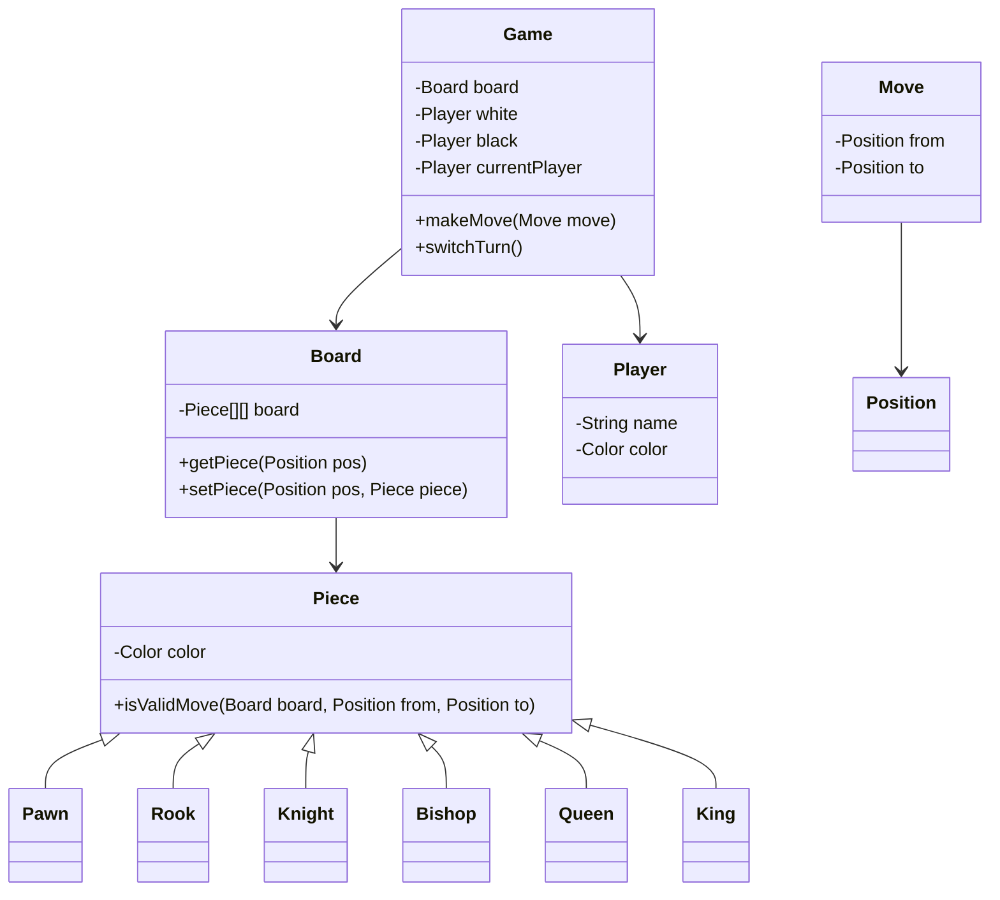

---

# 1. Problem Decomposition

The goal is to design a **chess game engine** that manages a chessboard, pieces, and player turns while enforcing the rules of chess.

The system must:

* Represent the **board and pieces**
* Validate **legal moves**
* Track **game state** (turns, check, checkmate, etc.)
* Execute moves and update board state

The **core mission** of the system is:

> Maintain a consistent chessboard state and allow players to perform only **valid chess moves** according to the rules.

---

# 2. Clarifying Questions

Before designing, I would ask the interviewer:

1. **Is this multiplayer over network or local game?** (affects networking layer)
2. **Do we need AI / computer opponent?**
3. **Do we need move history and undo functionality?**
4. **Should we support chess rules like castling, en passant, promotion?**
5. **Do we need check/checkmate detection?**
6. **Do we need persistence of games?**
7. **Is the focus only on game logic or also UI?**

Typical assumption for LLD:

> Focus only on **core chess engine logic**.

---

# 3. The Mental Model

For board games like chess:

Start with **Nouns (Entities)** first.

Because the domain is **object-heavy**.

Important nouns:

```
Game
Board
Piece
Move
Player
Position
```

Actions (verbs) will naturally come after:

```
movePiece()
validateMove()
isCheck()
switchTurn()
```

A **very common mistake** candidates make:

❌ Putting move logic inside `Game` class.

Better:

✔ Each **Piece knows how it moves**

---

# 4. The First Move (Foundation Class)

The first class to design should be:

```
Piece (abstract class)
```

Why?

Because:

* Chess rules are **piece-dependent**
* Each piece has **different movement logic**

Example:

```
Pawn -> forward + capture diagonal
Rook -> straight
Knight -> L shape
```

So we create:

```
abstract class Piece
```

And subclasses:

```
Pawn
Rook
Knight
Bishop
Queen
King
```

---

# 5. Data Structure Decisions

## Board Representation

Best option:

```
Piece[][] board = new Piece[8][8]
```

Why?

* Chess board size is fixed
* O(1) access
* simple coordinates

---

## Move History

```
List<Move>
```

Why?

* track moves
* undo support
* replay

---

## Players

```
Player white
Player black
```

---

## Position

```
class Position {
    int row;
    int col;
}
```

Encapsulation avoids bugs.

---

# 6. Design Patterns

## Strategy Pattern (Important)

Each piece has its own **movement strategy**.

```
Piece -> validateMove()
Pawn -> specific logic
Rook -> specific logic
```

This avoids:

❌ giant if-else statements.

---

## Factory Pattern (Optional)

Used when **creating pieces**.

Example:

```
PieceFactory.createPiece(type)
```

Useful for **initial board setup**.

---

# 7. Class Diagram



---

# 8. Java Implementation

## Color Enum

```java
public enum Color {
    WHITE,
    BLACK
}
```

---

# Position

```java
public class Position {

    private int row;
    private int col;

    public Position(int row, int col) {
        if(row < 0 || row >= 8 || col < 0 || col >= 8) {
            throw new IllegalArgumentException("Invalid board position");
        }
        this.row = row;
        this.col = col;
    }

    public int getRow() { return row; }
    public int getCol() { return col; }
}
```

---

# Move

```java
public class Move {

    private Position from;
    private Position to;

    public Move(Position from, Position to) {
        this.from = from;
        this.to = to;
    }

    public Position getFrom() { return from; }
    public Position getTo() { return to; }
}
```

---

# Piece (Abstract)

```java
public abstract class Piece {

    protected Color color;

    public Piece(Color color) {
        this.color = color;
    }

    public Color getColor() {
        return color;
    }

    public abstract boolean isValidMove(Board board, Position from, Position to);
}
```

---

# Pawn Example

```java
public class Pawn extends Piece {

    public Pawn(Color color) {
        super(color);
    }

    @Override
    public boolean isValidMove(Board board, Position from, Position to) {

        int direction = (color == Color.WHITE) ? -1 : 1;

        int rowDiff = to.getRow() - from.getRow();
        int colDiff = Math.abs(to.getCol() - from.getCol());

        // move forward
        if(colDiff == 0 && rowDiff == direction) {
            return board.getPiece(to) == null;
        }

        // capture
        if(colDiff == 1 && rowDiff == direction) {
            Piece target = board.getPiece(to);
            return target != null && target.getColor() != this.color;
        }

        return false;
    }
}
```

---

# Board

```java
public class Board {

    private Piece[][] board;

    public Board() {
        board = new Piece[8][8];
    }

    public Piece getPiece(Position pos) {
        return board[pos.getRow()][pos.getCol()];
    }

    public void setPiece(Position pos, Piece piece) {
        board[pos.getRow()][pos.getCol()] = piece;
    }

}
```

---

# Player

```java
public class Player {

    private String name;
    private Color color;

    public Player(String name, Color color) {
        this.name = name;
        this.color = color;
    }

    public Color getColor() {
        return color;
    }
}
```

---

# Game (Controller)

```java
public class Game {

    private Board board;
    private Player white;
    private Player black;
    private Player currentPlayer;

    public Game(Player white, Player black) {
        this.board = new Board();
        this.white = white;
        this.black = black;
        this.currentPlayer = white;
    }

    public boolean makeMove(Move move) {

        Piece piece = board.getPiece(move.getFrom());

        if(piece == null) {
            throw new IllegalStateException("No piece at source position");
        }

        if(piece.getColor() != currentPlayer.getColor()) {
            throw new IllegalStateException("Not your turn");
        }

        if(!piece.isValidMove(board, move.getFrom(), move.getTo())) {
            return false;
        }

        board.setPiece(move.getTo(), piece);
        board.setPiece(move.getFrom(), null);

        switchTurn();
        return true;
    }

    private void switchTurn() {
        currentPlayer = (currentPlayer == white) ? black : white;
    }
}
```

---

# Common LLD Interview Traps (Very Important)

### Trap 1 — Huge Game Class

Bad:

```
Game.validatePawnMove()
Game.validateRookMove()
```

Good:

```
Pawn.isValidMove()
Rook.isValidMove()
```

---

### Trap 2 — Using Strings for pieces

Bad:

```
"pawn"
"rook"
```

Good:

```
class Pawn extends Piece
```

---

### Trap 3 — No Position class

Bad:

```
move(int x1, int y1, int x2, int y2)
```

Good:

```
Move(Position from, Position to)
```

---

# If this were a real interview

A senior engineer would then ask:

1️⃣ How would you support **castling**?
2️⃣ How would you detect **checkmate**?
3️⃣ How would you implement **undo move**?
4️⃣ How would you support **AI player**?

These extend the design.

---

