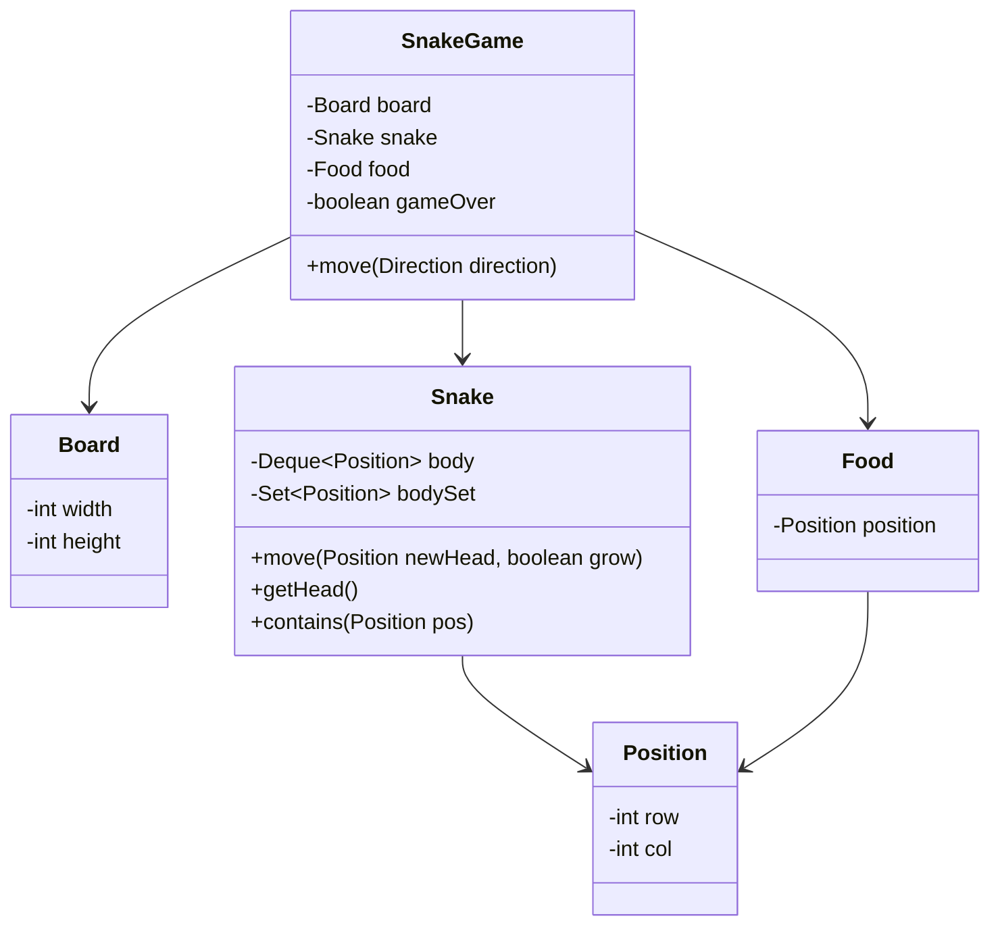

---

# 1. Problem Decomposition

The system simulates a **Snake game** where a snake moves on a grid, eats food, grows in length, and the game ends if the snake hits the wall or itself.

The core responsibilities are:

* Maintain the **grid/board state**
* Track the **snake body and movement**
* Spawn and manage **food**
* Detect **collisions and game over conditions**

The main mission:

> Maintain the evolving state of the snake and board while processing player movement and food consumption correctly.

---

# 2. Clarifying Questions

Before designing, I would ask:

1. What is the **grid size**? Is it fixed or configurable?
2. Should food appear **randomly** or from a predefined list?
3. Should we support **multiple food items** or only one at a time?
4. Is the snake allowed to **wrap around the board**, or hitting a wall ends the game?
5. Do we need to track **score**?
6. Is the game **single-player only**?
7. Do we need **thread safety** (e.g., UI thread + game engine)?

Typical assumption for LLD interview:

* Fixed board
* Single snake
* One food at a time
* Game ends on wall/self collision

---

# 3. The Mental Model

For this problem:

Start with **Entities (Nouns)**.

Important objects:

```
Game
Board
Snake
Food
Position
Direction
```

Actions will naturally appear:

```
moveSnake()
generateFood()
checkCollision()
growSnake()
```

Key insight:

> The snake is basically a **queue of positions** representing its body.

---

# 4. The "First Move"

The first class to design:

```
Snake
```

Why?

Because the **entire game revolves around the snake**.

The snake must:

* Move
* Grow
* Track body
* Detect self collision

Internally it will use:

```
Deque<Position>
```

Head = front
Tail = back

This makes move operations **O(1)**.

---

# 5. Data Structure Decisions

## Snake Body

```
Deque<Position>
```

Why?

* Add new head → `addFirst()`
* Remove tail → `removeLast()`

Perfect for **snake movement mechanics**.

---

## Collision Detection

```
Set<Position>
```

Why?

To detect **self collision in O(1)**.

Without it:

```
O(N) scan every move
```

Which is inefficient.

---

## Board

```
int width
int height
```

We usually **don't store a 2D board array** because:

* Only snake and food matter
* Everything else is empty

---

## Food

```
Position food
```

Single food at a time.

---

# 6. Design Patterns

## Strategy Pattern (optional)

Movement rules could be abstracted.

Example:

```
MoveStrategy
```

But for Snake it's usually unnecessary.

---

## Factory Pattern

Used for **Food generation**.

Example:

```
FoodGenerator.generateFood()
```

This separates food logic from the game engine.

---

# 7. Class Diagram



---

# 8. Java Implementation

## Direction Enum

```java
public enum Direction {
    UP, DOWN, LEFT, RIGHT
}
```

---

# Position

```java
public class Position {

    private int row;
    private int col;

    public Position(int row, int col) {
        this.row = row;
        this.col = col;
    }

    public int getRow() { return row; }
    public int getCol() { return col; }

    @Override
    public boolean equals(Object o) {
        if(this == o) return true;
        if(!(o instanceof Position)) return false;

        Position p = (Position) o;
        return row == p.row && col == p.col;
    }

    @Override
    public int hashCode() {
        return 31 * row + col;
    }
}
```

Important for **HashSet usage**.

---

# Board

```java
public class Board {

    private int width;
    private int height;

    public Board(int width, int height) {
        this.width = width;
        this.height = height;
    }

    public boolean isInside(Position pos) {
        return pos.getRow() >= 0 &&
               pos.getRow() < height &&
               pos.getCol() >= 0 &&
               pos.getCol() < width;
    }
}
```

---

# Snake

```java
import java.util.*;

public class Snake {

    private Deque<Position> body;
    private Set<Position> bodySet;

    public Snake(Position start) {
        body = new LinkedList<>();
        bodySet = new HashSet<>();

        body.addFirst(start);
        bodySet.add(start);
    }

    public Position getHead() {
        return body.peekFirst();
    }

    public boolean contains(Position pos) {
        return bodySet.contains(pos);
    }

    public void move(Position newHead, boolean grow) {

        body.addFirst(newHead);
        bodySet.add(newHead);

        if(!grow) {
            Position tail = body.removeLast();
            bodySet.remove(tail);
        }
    }
}
```

Movement complexity:

```
O(1)
```

---

# Food

```java
public class Food {

    private Position position;

    public Food(Position position) {
        this.position = position;
    }

    public Position getPosition() {
        return position;
    }
}
```

---

# SnakeGame (Game Engine)

```java
import java.util.Random;

public class SnakeGame {

    private Board board;
    private Snake snake;
    private Food food;
    private boolean gameOver;

    public SnakeGame(int width, int height) {

        this.board = new Board(width, height);

        Position start = new Position(height / 2, width / 2);
        this.snake = new Snake(start);

        generateFood();
    }

    public boolean move(Direction direction) {

        if(gameOver) {
            throw new IllegalStateException("Game already finished");
        }

        Position head = snake.getHead();
        Position next = nextPosition(head, direction);

        if(!board.isInside(next) || snake.contains(next)) {
            gameOver = true;
            return false;
        }

        boolean grow = next.equals(food.getPosition());

        snake.move(next, grow);

        if(grow) {
            generateFood();
        }

        return true;
    }

    private Position nextPosition(Position head, Direction direction) {

        int row = head.getRow();
        int col = head.getCol();

        switch(direction) {
            case UP: row--; break;
            case DOWN: row++; break;
            case LEFT: col--; break;
            case RIGHT: col++; break;
        }

        return new Position(row, col);
    }

    private void generateFood() {

        Random random = new Random();

        int row = random.nextInt(boardHeight());
        int col = random.nextInt(boardWidth());

        food = new Food(new Position(row, col));
    }

    private int boardWidth() {
        return 10;
    }

    private int boardHeight() {
        return 10;
    }
}
```

---

# Important Interview Traps

### Trap 1 — Using a List for snake

Bad:

```
List<Position>
```

Movement becomes **O(N)**.

Correct:

```
Deque
```

---

### Trap 2 — No HashSet for collision

Bad:

```
scan entire snake body
```

Correct:

```
Set<Position>
```

O(1) lookup.

---

### Trap 3 — Storing entire board matrix

Wasteful.

Better:

```
snake positions + food
```

---
